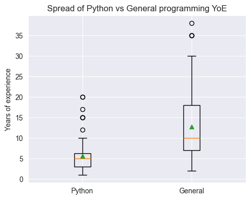
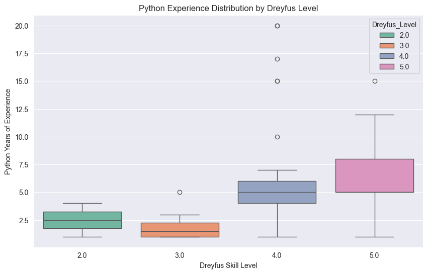

# EXCEED Python Skill Level Assessment

This repository holds **everything** needed to reproduce the analyses for the 2025 Qualtrics Python proficiency
assessment survey: the raw Qualtrics questionnaire, anonymised response data, Jupyter notebooks for cleaning / scoring,
and several miscellaneous files that were useful during the project.
It is one of several companion repositories for the upcoming paper within the EXCEED framework:
*"Learning-Enhanced Variable Error expLanations."*

The research that this repository supports is part of the EXCEED Master's thesis project by **Alexandru-Radu Moraru**
at Delft University of Technology, part of the **Web Information Systems** research group.

> **Note**: The goal of the Qualtrics survey was to find a better way to objectively assess Python proficiency, while
> centering questions around common errors, identification, resolution, and understanding, rather than general
> programming knowledge.

---

## 🗂️ Folder structure

```
├── data/
│   ├── processed/
│   ├── survey_answers.csv
│   └── survey_results.csv
├── notebooks/
│   ├── 01_high_level_analysis.ipynb
│   ├── 02_detailed_analysis.ipynb
│   ├── 03_visualisation.ipynb
│   └── requirements.txt
├── survey/
│   ├── old_md_versions/
│   ├── qualtrics_final_survey.qsf
│   ├── qualtrics_final_survey.pdf
│   └── ConsentFormPythonQualtricsEXCEED.pdf
└── misc/
```

* **data/** – Raw and cleaned survey data files. The `survey_results.csv` file contains the anonymised responses,
  while `survey_answers.csv` includes the raw answers with question IDs (the actual answers are label-encoded).
  Additionally, the `processed/` subfolder contains some intermediate data files used during the analysis, which are
  also used for visualisation and scoring in the notebooks.
* **notebooks/** – Fully runnable notebooks that replicate every table, figure, and metric pertaining to the Qualtrics
  Python skill level assessment. The `requirements.txt` file lists the Python dependencies needed to run them.
* **survey/** – The exact question text (\*.qsf + printable PDF) plus the consent form used in the actual survey.
  The `old_md_versions/` folder contains previous Markdown versions of the survey text, which may be useful for
  historical reference.
* **misc/** – Some miscellaneous files that were useful during the project. These ought to be ignored.

---

## 🤨 Qualtrics survey block composition

| Block ID     | Question IDs | Theme / purpose                                                                                                                           |
|--------------|--------------|-------------------------------------------------------------------------------------------------------------------------------------------|
| **Block 1**  | Q1.1         | Welcome, consent & study briefing                                                                                                         |
| **Block 2**  | Q2.1–Q2.3    | Background & experience (Python experience using Dreyfus model, Python YoE, general programming YoE)                                      |
| **Block 3**  | Q3.1–Q3.7    | **General Programming Error Understanding** (i.e., not necessarily Python-specific questions)                                             |
| **Block 4**  | Q4.1–Q4.7    | **Python-specific General Error Understanding** (i.e., covering high-level Python error aspects)                                          |
| **Block 5**  | Q5.1–Q5.7    | **Error Identification** (i.e., given a snippet of code, identify the error)                                                              |
| **Block 6**  | Q6.1–Q6.7    | **Error Resolution** (i.e., given a problematic code snippet, find the right fix)                                                         |
| **Block 7**  | Q7.1–Q7.7    | **Code Reading/Understanding** (i.e., given some code, attempt to understand whether it does what it's intended to do)                    |
| **Block 8**  | Q8.1–Q8.7    | **Error Message Comprehension** (i.e., given an error message and no code, try to understand the underlying issue)                        |
| **Block 9**  | Q9.1–Q9.7    | **Natural Language Scenarios** (i.e., given a hypothetic scenario with no code or error message, try to understand the most likely issue) |
| **Block 10** | Q10.1–Q10.7  | **Various Complexity & Scope** (i.e, a mix of several aspects of potentially higher difficulty)                                           |
| **Block 11** | Q11.1        | Self‑assessment – "How many survey questions do you think you answered correctly?" (0-16)                                                 |

> **Notes:**
> * Only Blocks 3–10 are scored; Blocks 2 and 11 feed the experience/confidence covariates used in the analysis.
> * The questions within blocks 3-10 are randomised for each participant (2 questions per block, 8 blocks total).
> * The answer choices to each question are also randomised to avoid choice bias, guessing, or cheating.

---

## 🔎 Highlights - Findings & Results

This section summarises the key findings from the analysis notebooks. For more details, please refer to the notebooks.
The findings here reflect the analysis of the results collected as of June 2nd, 2025.

### 1. High-Level Analysis

The first notebook (`01_high_level_analysis.ipynb`) provides an overview of the survey results, including:

- **Total Participants**: 78
- **Completed Surveys**: 60
- **Median Duration of Completion**: 986.5 seconds (approx. 16 minutes)
- **Average Python YoE**: 5.7
- **Average General Programming YoE**: 12.7
- **Average Dreyfus Python Skill Level**: 4.02
- **Average estimated correct answers**: 12.2 out of 16
- **Correlation between Python YoE and Dreyfus Skill Level**: 0.34 (weak positive correlation - somewhat surprising)
- **Correlation between Python YoE and general programming YoE**: 0.55 (moderate positive correlation - expected)
- **Correlation between Python YoE and estimated correct answers**: 0.24 (weak positive correlation - surprising)
- **Correlation between general programming YoE and estimated correct answers**: 0.03 (very weak positive correlation -
  surprising)

### 2. Detailed Analysis

The second notebook (`02_detailed_analysis.ipynb`) explores the actual performance of participants and provides
means to rank the survey's questions by difficulty, and ability to discriminate between different skill levels.
Some of the key findings include:

- **Average Correct Answers**: 10.78 out of 16
- **Correlation between Python YoE and actual correct answers**: 0.28 (weak positive correlation)
- **Correlation between general programming YoE and actual correct answers**: 0.06 (very weak positive correlation)
- **Correlation between estimated correct answers and actual correct answers**: 0.41 (quite weak positive correlation)

### 3. Visualization

The third notebook (`03_visualisation.ipynb`) provides visualizations of some of the survey results.
In includes boxplots, histograms, and other visualizations. For example, consider the following boxplots:

| Python YoE vs. General Programming YoE                                                | Python YoE vs. Dreyfus Skill Level                                                 |
|---------------------------------------------------------------------------------------|------------------------------------------------------------------------------------|
|  |  |

Alternatively, we can also check the distribution of Python YoE and general programming YoE with the following table:

| YoE Category | count | mean  | std  | min | 25% | 50% | 75%  | max |
|--------------|-------|-------|------|-----|-----|-----|------|-----|
| Python YoE   | 60	   | 5.7   | 4.55 | 1   | 3   | 5   | 6.25 | 20  |
| General YoE  | 60	   | 12.76 | 9.40 | 2   | 7   | 10  | 18   | 38  |

### 4. Observations

Within this survey, some questions were intentionally designed to be ambiguous or tricky. Unfortunately, in some cases,
the actual answers were heavily dependent on the interpretation of the question, which led to some confusion. For this
reason, for some questions it was technically possible to consider multiple answers as correct (more specifically 2
options out of 4 were considered correct for some questions). This was done to avoid penalising participants for
thinking differently. In this section we will list the questions where this was the case, along with the correct
answers:

- **Q8.6** Based only on the error message below, which option best explains the cause of the error?

    ```
    Traceback (most recent call last):
    File "main.py", line 3, in <module>
        my_list.remove(10)
    ValueError: list.remove(x): x not in list
    ```

    - A) The list `my_list` is empty, therefore nothing can be removed
    - B) The value of `x` is not found in `my_list`, so it can't be removed
    - C) You must assign the result of `.remove()` to a new variable
    - D) The value of `10` is not found in `my_list`, so it can't be removed

  > **Correct Answers**: while the original question only had option D as correct, we considered both B and D as correct

- **Q9.5** You're writing a program that uses a dictionary to store user preferences. You try to access a key that you
  _know_ exists in the dictionary, but your code throws a `KeyError`. What is the MOST likely reason for this, given the
  limited context?

    - A) The key might have been altered or removed elsewhere in the code
    - B) The key is actually a string, but you’re trying to access it with an integer
    - C) There’s a typo in the key you are trying to access (e.g., `"User"` vs `"user"`), or the case sensitivity is
      different than expected
    - D) Dictionaries can sometimes fail to locate keys due to internal hashing bugs or collisions

  > **Correct Answers**: while the original question only had option C as correct, we considered both A and C as correct

### 5. Conclusion

In terms of the actual final chosen subset of questions, we investigated the following filtering
criteria for the difficulty range of the questions:

1. **Default Range**: 0.25 < Difficulty < 0.85
2. **Wider Range**: 0.20 < Difficulty < 0.90
3. **Widest Range**: 0.20 < Difficulty < 0.95

We found that the **Widest Range** (0.20 < Difficulty < 0.95) yielded the most useful set of questions (i.e., with the
best "discrimination power" between the 2 skill levels). Additionally, we also experimented with choosing 1 or 2
questions per block. We found that choosing just 1 question per block is ideal, as it yields the absolute best
question set, while also keeping the survey short enough to used in follow-up studies that we are interested in.

The final set of "optimal" questions according to top-1 per block, using the **Widest Range** difficulty criteria is:

| Question ID | Difficulty | Discrimination Index |
|-------------|------------|----------------------|
| Q3.4        | 	0.78      | 	0.06                |
| Q4.6	       | 0.82       | 	0.50                |
| Q5.2	       | 0.83       | 	0.65                |
| Q6.5	       | 0.84       | 	0.60                |
| Q7.1	       | 0.88       | 	0.81                |
| Q8.2	       | 0.78       | 	0.40                |
| Q9.5        | 	0.76      | 	0.30                |
| Q10.1       | 	0.87      | 	0.45                |

> **Note**: The difficulty and discrimination index values are derived from the analysis of the survey results.
> The difficulty index is a measure of how challenging a question is, while the discrimination index indicates how well
> a question can differentiate between participants of different skill levels.
> In terms of interpretation, the following ranges can be used:
> - **0.00 - 0.19/0.2**: Weak discriminator / Should be replaced
> - **0.20 - 0.29**: Acceptable discriminator
> - **>= 0.30**: Strong discriminator
>
> As such, the only question that is not a strong discriminator is Q3.4, which is a general programming question.

---

## 🏃🏻 Running the notebooks

1. **Clone or fork** the repo

   ```bash
   git clone https://github.com/alemoraru/exceed-python-skill-assessment.git
   cd exceed-python-skill-assessment
   ```
2. **Create a fresh Python ≥3.12 environment** (virtualenv or conda)

   ```bash
   python -m venv .venv
   source .venv/bin/activate
   cd notebooks
   ```
3. **Install dependencies (Optional)**

   ```bash
   pip install -r requirements.txt
   ```

   This step is optional, since each notebook will run `pip install -r requirements.txt` as the first step.

4. **Launch Jupyter** and run the notebooks top‑to‑bottom

   ```bash
   jupyter lab 01_high_level_analysis.ipynb
   jupyter lab 02_detailed_analysis.ipynb
   jupyter lab 02_visualisation.ipynb
   ```
   Alternatively, you can of course run the notebooks within VS Code or any other Jupyter-compatible IDE
   (e.g., PyCharm).

---

## 🪪 Licensing

| Component                                                       | License                     |
|-----------------------------------------------------------------|-----------------------------|
| Jupyter notebooks (`/notebooks`) & derived data files (`/data`) | **MIT**                     |
| Original Qualtrics survey text (`/survey`)                      | **Creative Commons BY 4.0** |

You are free to reuse/modify the code and anonymised data with attribution. If you quote or adapt the survey items,
please credit the original authors as per the CC‑BY 4.0 terms.
